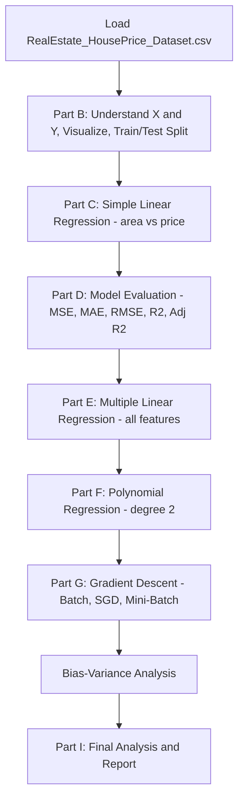

# 🏠 Prediction Insight Engine — House Price Prediction


---

## 📖 Project Overview

**Prediction Insight Engine** is a regression-based Machine Learning project 🤖 that predicts **house prices (₹ INR)** from property features such as area, bedrooms, bathrooms, location score, and age. It walks through the **complete regression workflow**: dataset understanding → Simple Linear Regression → Model Evaluation → Multiple Linear Regression → Polynomial Regression → Gradient Descent from scratch (Batch / SGD / Mini-Batch) → Bias-Variance analysis → Final report.

The notebook is structured assignment-style, answering **Q7 to Q29** across Parts B–I, each with code 💻, output, and a written interpretation 📝.

---

## 📎 Assignment Resources

| Part | Type | Link |
|---|---|---|
| 📄 **Part A — Theory Questions (Q1–Q6)** | PDF | [Add your Part A PDF link here](#) |
| 🎥 **Video Walkthrough** | Video | [Add your video link here](#) |

> ✏️ Replace the `#` above with your actual PDF / Google Drive / YouTube link once uploaded.

---

## 🎯 Objectives

- 📂 Load and understand the `RealEstate_HousePrice_Dataset.csv`
- 🔍 Identify independent (X) and dependent (Y) variables
- 📊 Visualize relationships between each feature and house price
- ✂️ Split data into training and testing sets (80:20)
- 📈 Build Simple Linear Regression (area → price)
- 🧮 Evaluate models with MSE, MAE, RMSE, R², Adjusted R²
- 🧩 Build Multiple Linear Regression (all features)
- 🌀 Build Polynomial Regression (degree 2) and compare with Linear
- 🔎 Detect overfitting / underfitting via train vs test R²
- ⚙️ Implement Gradient Descent **from scratch**: Batch, Stochastic, Mini-Batch
- ⚖️ Analyze the Bias–Variance trade-off
- 📝 Summarize everything in a final report

---

## 🔄 Project Workflow



---

## 📁 Dataset Information

**File:** `RealEstate_HousePrice_Dataset.csv`

| Column | Description |
|---|---|
| `house_id` | Unique property identifier |
| `area_sqft` | Area of the house in square feet |
| `bedrooms` | Number of bedrooms |
| `bathrooms` | Number of bathrooms |
| `location_score` | Numeric score representing location desirability |
| `age_years` | Age of the property in years |
| `distance_city_km` | Distance from the city center (km) |
| `lot_size_sqft` | Total lot size in square feet |
| `has_garage` | Whether the property has a garage (0/1) |
| `has_pool` | Whether the property has a pool (0/1) |
| `renovation_years_ago` | Years since last renovation |
| `house_price_inr` | 🎯 **Target variable** — house price in INR |

---

## 🛠️ Libraries Used

```python
import numpy as np
import pandas as pd
import matplotlib.pyplot as plt
from sklearn.model_selection import train_test_split
from sklearn.linear_model import LinearRegression
from sklearn.metrics import mean_squared_error, r2_score, mean_absolute_error
from sklearn.preprocessing import PolynomialFeatures
import time
```

| Library | Purpose |
|---|---|
| **NumPy 🔢** | Array math, manual Gradient Descent calculations |
| **Pandas 🐼** | Loading and handling the dataset |
| **Matplotlib 📉** | Scatter plots, regression lines, cost curves |
| **train_test_split** | Splitting data into training/testing sets |
| **LinearRegression** | Simple & Multiple Linear Regression models |
| **PolynomialFeatures** | Generating polynomial (degree-2) features |
| **mean_squared_error / mean_absolute_error / r2_score** | Model evaluation metrics |
| **time ⏱️** | Measuring training time for Gradient Descent variants |

---

## 📚 Notebook Structure (Q7 – Q29)

✅ **Part B** – Dataset Understanding & Preparation (Q7–Q9)
✅ **Part C** – Simple Linear Regression (Q10–Q12)
✅ **Part D** – Model Evaluation (Q13–Q14)
✅ **Part E** – Multiple Linear Regression (Q15–Q17)
✅ **Part F** – Polynomial Regression (Q18–Q20)
✅ **Part G** – Gradient Descent Optimization (Q21–Q25)
✅ **Bias–Variance Analysis** (Q26–Q28)
✅ **Part I** – Final Analysis & Reporting (Q29)

---

## 📦 Import Libraries & Load Dataset

```python
import numpy as np
import pandas as pd
import matplotlib.pyplot as plt
from sklearn.model_selection import train_test_split
from sklearn.linear_model import LinearRegression
from sklearn.metrics import mean_squared_error, r2_score, mean_absolute_error
from sklearn.preprocessing import PolynomialFeatures
import time

df = pd.read_csv("RealEstate_HousePrice_Dataset.csv")
print(df.head())
```

🧠 **Explanation:** Loads the dataset into a Pandas DataFrame and previews the first 5 rows to confirm it read correctly.

---

# 🅱️ Part B — Dataset Understanding & Preparation

### Q7 — Independent & Dependent Variables

```python
# Independent variables
x = df[[
    "house_id", "area_sqft", "bedrooms", "bathrooms", "location_score",
    "age_years", "distance_city_km", "lot_size_sqft",
    "has_garage", "has_pool", "renovation_years_ago"
]]

# Dependent variable
y = df["house_price_inr"]

print("Independent variables:")
print(x.columns)
print("Dependent Variable:")
print(y.name)
```

🧠 **Explanation:** `x` holds every **predictor column** (features), and `y` holds the **target** the model must learn to predict — `house_price_inr`.

📝 **Interpretation:** The independent variables are the features used to predict house price (area, bedrooms, bathrooms, location score, age, etc.). The dependent variable is `house_price_inr`, the target the model tries to predict.

---

### Q8 — Visualize Relationships

```python
features = ["house_id","area_sqft","bedrooms","bathrooms","location_score",
            "age_years","distance_city_km","lot_size_sqft",
            "has_garage","has_pool","renovation_years_ago"]

for features in features:
    plt.figure(figsize=(10, 6))
    plt.scatter(df[features], df["house_price_inr"])
    plt.xlabel(features)
    plt.ylabel("House Price (INR)")
    plt.title(f"House Price vs {features}")
    plt.grid(True)
    plt.show()
```

🧠 **Explanation:** Loops through every feature and draws a **scatter plot vs `house_price_inr`**, so you can visually spot which features have a strong (linear-looking) relationship with price.

📝 **Interpretation:** A clear upward/downward pattern suggests a real relationship with price; a random scatter suggests a weak one.

---

### Q9 — Train/Test Split

```python
x_train, x_test, y_train, y_test = train_test_split(x, y, test_size=0.2, random_state=42)

print("Training data", x_train.shape)
print("Testing data", x_test.shape)
```

🧠 **Explanation:** `test_size=0.2` 👉 reserves **20% of rows for testing**; `random_state=42` 👉 makes the split **reproducible** every time the code runs.

📝 **Interpretation:** 80% trains the model, 20% is held back to check how well it generalizes to unseen data.

---

# 🅲️ Part C — Simple Linear Regression

### Q10 — Using House Area

```python
x = df[["area_sqft"]]
y = df["house_price_inr"]

x_train, x_test, y_train, y_test = train_test_split(x, y, test_size=0.2, random_state=42)

model = LinearRegression()
model.fit(x_train, y_train)

y_pred = model.predict(x_test)
print(y_pred)
```

🧠 **Explanation:** `model.fit()` 👉 learns the **best-fit line** (slope + intercept) between `area_sqft` and price using only the training data; `.predict()` 👉 applies that line to unseen test data.

📝 **Interpretation:** The model learns the relationship between house area and house price using a single feature.

---

### Q11 — Plot Regression Line

```python
plt.figure(figsize=(7,5))
plt.scatter(x_test, y_test, label="Actual")
plt.plot(x_test, y_pred, label="Regression line")
plt.xlabel("House Area")
plt.ylabel("House Price")
plt.title("Simple Linear Regression")
plt.legend()
plt.grid(True)
plt.show()
```

🧠 **Explanation:** Overlays the **predicted line** on top of the **actual scattered points** — the tighter the fit, the better the model.

📝 **Interpretation:** The closer the actual points are to the line, the better the model represents the relationship.

---

### Q12 — Check Assumptions (Residual Plot)

```python
residuals = y_test - y_pred

plt.figure(figsize=(6,4))
plt.scatter(y_pred, residuals)
plt.axhline(0)
plt.xlabel("Predicted Price")
plt.ylabel("Residuals")
plt.title("Residual Plot")
plt.grid(True)
plt.show()
```

🧠 **Explanation:** `residuals = actual - predicted` 👉 the **leftover error** for each point. Plotting residuals vs predictions checks the **linearity assumption**.

📝 **Interpretation:** Randomly scattered residuals around zero ✅ = linear model is reasonable. A visible pattern ❌ = a linear model may not be sufficient.

---

# 🅳️ Part D — Model Evaluation

### Q13 — MSE, MAE, RMSE, R², Adjusted R²

```python
mse = mean_squared_error(y_test, y_pred)
mae = mean_absolute_error(y_test, y_pred)
r2 = r2_score(y_test, y_pred)
rmse = np.sqrt(mse)

n = len(y_test)
p = x_test.shape[1]
adjusted_r2 = 1 - (1 - r2) * (n - 1) / (n - p - 1)

print("MSE:", mse)
print("MAE:", mae)
print("R2:", r2)
print("RMSE:", rmse)
print("Adjusted R2:", adjusted_r2)
```

🧠 **Explanation:** `n` = test-set size, `p` = number of predictors. Adjusted R² **penalizes** adding predictors that don't genuinely improve the model — unlike plain R², which never decreases when you add more features.

### Q14 — Metric Interpretation 📝

| Metric | Meaning |
|---|---|
| **MSE** | Average **squared** prediction error. Lower is better. |
| **MAE** | Average **absolute** difference between actual & predicted price. Lower is better, easy to interpret. |
| **RMSE** | √MSE — penalizes **large errors** more. Lower is better. |
| **R²** | % of price variation explained by the model. Higher is generally better. |
| **Adjusted R²** | Like R², but accounts for the **number of predictors** — useful when comparing models with different feature counts. |

---

# 🅴️ Part E — Multiple Linear Regression

### Q15 — Use All Features

```python
x = df[["house_id","area_sqft","bedrooms","bathrooms","location_score",
        "age_years","distance_city_km","lot_size_sqft",
        "has_garage","has_pool","renovation_years_ago"]]
y = df["house_price_inr"]

x_train, x_test, y_train, y_test = train_test_split(x, y, test_size=0.2, random_state=42)

model_multi = LinearRegression()
model_multi.fit(x_train, y_train)

y_pred_multi = model_multi.predict(x_test)
print(y_pred_multi)
```

🧠 **Explanation:** Same `LinearRegression` class as before, but now `x` has **11 columns instead of 1** — the model learns a separate weight (coefficient) for each feature.

📝 **Interpretation:** Using multiple property features gives the model more information than area alone.

---

### Q16 — Compare with Simple Linear Regression

```python
mse_multi = mean_squared_error(y_test, y_pred_multi)
mae_multi = mean_absolute_error(y_test, y_pred_multi)
r2_multi = r2_score(y_test, y_pred_multi)
rmse_multi = np.sqrt(mse_multi)

print("Multiple Linear Regression Metrics:")
print("MSE:", mse_multi)
print("MAE:", mae_multi)
print("R2:", r2_multi)
print("RMSE:", rmse_multi)
```

📝 **Interpretation:** Multiple Linear Regression can outperform Simple Linear Regression when the extra features carry real information — shown by lower MAE/RMSE and higher R² on test data.

### Q17 — Why Performance May Improve

```
House Area, Bedrooms, Bathrooms, Location Score, Age  →  House Price
```

📝 House price usually depends on more than just area, so adding **useful** features can improve prediction — but adding irrelevant or highly correlated features can sometimes make the model worse or less stable.

---

# 🅵️ Part F — Polynomial Regression

### Q18 — Polynomial Regression (Degree 2)

```python
x = df[["area_sqft"]]
y = df["house_price_inr"]

x_train, x_test, y_train, y_test = train_test_split(x, y, test_size=0.2, random_state=42)

poly = PolynomialFeatures(degree=2)
x_train_poly = poly.fit_transform(x_train)
x_test_poly = poly.transform(x_test)          # ⚠️ see note below

poly_model = LinearRegression()
poly_model.fit(x_train_poly, y_train)

y_pred_poly = poly_model.predict(x_test_poly)
```

🧠 **Explanation:** `PolynomialFeatures(degree=2)` 👉 expands `area_sqft` into `[area, area²]`, letting a **linear model fit a curve** instead of a straight line.

> ⚠️ **Bug note:** in the original notebook this line was written as `y_train_poly = poly.transform(x_test)` followed by `poly_model.predict(y_train_poly)` — the variable name `y_train_poly` is misleading since it's actually the **transformed `x_test`**. The cleaner version above (`x_test_poly`) does the exact same thing, just named correctly.

📝 **Interpretation:** Degree-2 Polynomial Regression captures a possible **non-linear (curved)** relationship between area and price, unlike a straight-line model.

---

### Q19 — Compare Linear vs Polynomial Regression

```python
linear_model = LinearRegression()
linear_model.fit(x_train, y_train)
y_pred_linear = linear_model.predict(x_test)

# Linear Regression metrics
linear_mae = mean_absolute_error(y_test, y_pred_linear)
linear_rmse = np.sqrt(mean_squared_error(y_test, y_pred_linear))
linear_r2 = r2_score(y_test, y_pred_linear)

# Polynomial Regression metrics
poly_mae = mean_absolute_error(y_test, y_pred_poly)
poly_rmse = np.sqrt(mean_squared_error(y_test, y_pred_poly))
poly_r2 = r2_score(y_test, y_pred_poly)

print("Linear Regression:", linear_mae, linear_rmse, linear_r2)
print("Polynomial Regression:", poly_mae, poly_rmse, poly_r2)
```

**📊 Visual Comparison**

```python
# Linear
plt.figure(figsize=(8,5))
plt.scatter(x_test, y_test, label="Actual", color="red")
plt.plot(x_test, y_pred_linear, label="Linear")
plt.xlabel("Area"); plt.ylabel("House price"); plt.title("Linear Regression")
plt.grid(True); plt.legend(); plt.show()

# Polynomial
plot_data = x_test.copy()
plot_data["prediction"] = y_pred_poly
plot_data = plot_data.sort_values("area_sqft")     # sort so the curve draws smoothly

plt.figure(figsize=(8,5))
plt.scatter(x_test, y_test, label="Actual")
plt.plot(plot_data["area_sqft"], plot_data["prediction"], label="Polynomial", color="red")
plt.xlabel("Area"); plt.ylabel("House price"); plt.title("Polynomial Regression")
plt.grid(True); plt.legend(); plt.show()
```

🧠 **Explanation:** `.sort_values("area_sqft")` 👉 important! Without sorting, `plt.plot()` would zig-zag between out-of-order x-values instead of drawing a smooth curve.

📝 **Interpretation:** Linear Regression gives a straight line; Polynomial Regression can capture curvature. Compare using MAE/RMSE/R² — lower error + higher R² on test data wins.

---

### Q20 — Overfitting / Underfitting Check

```python
linear_train_r2 = r2_score(y_train, linear_model.predict(x_train))
linear_test_r2 = r2_score(y_test, y_pred_linear)

poly_train_r2 = r2_score(y_train, poly_model.predict(x_train_poly))
poly_test_r2 = r2_score(y_test, y_pred_poly)

print("Polynomial Training R2:", poly_train_r2)
print("Polynomial Testing R2:", poly_test_r2)
```

📝 **Interpretation:**
- **Train R² high, Test R² much lower** → 🔴 **Overfitting** (memorized training data, fails on new data)
- **Both R² low** → 🟠 **Underfitting** (model too simple to capture the pattern)
- **Both R² high and close** → 🟢 **Good fit** (generalizes well)

---

# 🅶️ Part G — Gradient Descent Optimization

### Q21 — What is Gradient Descent?

```
Start with random values → Make prediction → Calculate error
   → Calculate gradient → Update parameters → Repeat → Minimum error
```

📝 **Interpretation:** Gradient Descent is an optimization algorithm that **minimizes the cost function** by repeatedly nudging model parameters in the direction that reduces prediction error.

---

### Q22 — Batch Gradient Descent (from scratch)

```python
x = df["area_sqft"].values
y = df["house_price_inr"].values

# Standardize (mean=0, std=1) — required for gradient descent to converge well
x = (x - np.mean(x)) / np.std(x)
y = (y - np.mean(y)) / np.std(y)

beta0, beta1 = 0, 0
learning_rate = 0.01
epochs = 1000
costs = []
n = len(x)

for epoch in range(epochs):
    y_pred = beta0 + beta1 * x
    error = y_pred - y

    cost = np.mean(error**2)
    costs.append(cost)

    gradient_b0 = (2/n) * np.sum(error)
    gradient_b1 = (2/n) * np.sum(error * x)

    beta0 = beta0 - learning_rate * gradient_b0
    beta1 = beta1 - learning_rate * gradient_b1

print("Beta 0:", beta0)
print("Beta 1:", beta1)

plt.plot(costs)
plt.xlabel("Epoch"); plt.ylabel("Cost")
plt.title("Batch Gradient Descent"); plt.grid(True); plt.show()
```

🧠 **Explanation:**
- **Standardizing** `x` and `y` 👉 puts both on the same scale so gradient descent doesn't overshoot or converge too slowly.
- Each epoch uses the **entire dataset** at once to compute the gradient (hence "Batch").
- `beta0` = intercept, `beta1` = slope — updated every epoch by moving **against** the gradient direction.
- The `costs` list lets you **plot convergence** — a smoothly decreasing curve means it's learning correctly.

📝 **Interpretation:** Batch Gradient Descent uses the full training set per update, so convergence is generally **stable and smooth**.

---

### Q23 — Stochastic Gradient Descent (SGD)

```python
x = df["area_sqft"].values
y = df["house_price_inr"].values
x = (x - np.mean(x)) / np.std(x)
y = (y - np.mean(y)) / np.std(y)

beta0, beta1 = 0, 0
learning_rate = 0.01
epochs = 100
costs = []
n = len(x)

for epoch in range(epochs):
    for i in range(n):                              # one row at a time
        y_pred = beta0 + beta1 * x[i]
        error = y_pred - y[i]
        gradient_b0 = 2 * error
        gradient_b1 = 2 * error * x[i]

        beta0 = beta0 - learning_rate * gradient_b0
        beta1 = beta1 - learning_rate * gradient_b1

    y_pred_all = beta0 + beta1 * x
    cost = np.mean((y_pred_all - y) ** 2)
    costs.append(cost)

print("Beta 0:", beta0)
print("Beta 1:", beta1)

plt.plot(costs)
plt.xlabel("Epoch"); plt.ylabel("Cost")
plt.title("Stochastic Gradient Descent"); plt.show()
```

🧠 **Explanation:** Instead of using all rows, SGD updates `beta0`/`beta1` after **every single row** — many small, fast updates per epoch instead of one big update.

📝 **Interpretation:** SGD can converge faster (more frequent updates) but the cost curve is typically **noisier/more jittery** than Batch Gradient Descent.

---

### Q24 — Mini-Batch Gradient Descent

```python
x = df["area_sqft"].values
y = df["house_price_inr"].values
x = (x - np.mean(x)) / np.std(x)
y = (y - np.mean(y)) / np.std(y)

beta0, beta1 = 0, 0
learning_rate = 0.01
epochs = 100
batch_size = 32
costs = []
n = len(x)

for epoch in range(epochs):
    for start in range(0, n, batch_size):            # step through in chunks of 32
        end = start + batch_size
        x_batch = x[start:end]
        y_batch = y[start:end]

        y_pred = beta0 + beta1 * x_batch
        error = y_pred - y_batch
        m = len(x_batch)

        gradient_b0 = (2/m) * np.sum(error)
        gradient_b1 = (2/m) * np.sum(error * x_batch)

        beta0 = beta0 - learning_rate * gradient_b0
        beta1 = beta1 - learning_rate * gradient_b1

    y_pred_all = beta0 + beta1 * x
    cost = np.mean((y_pred_all - y) ** 2)
    costs.append(cost)

print("Beta 0:", beta0)
print("Beta 1:", beta1)

plt.plot(costs)
plt.xlabel("Epoch"); plt.ylabel("Cost")
plt.title("Mini-Batch Gradient Descent"); plt.show()
```

🧠 **Explanation:** `batch_size = 32` 👉 splits the data into small chunks; each chunk gets one gradient update. This is the **middle ground** between Batch (whole dataset) and SGD (one row).

📝 **Interpretation:** Mini-Batch balances stability (like Batch) and speed (like SGD) — the most commonly used approach in real-world ML/deep learning.

---

### Q25 — Compare Convergence & Training Time

```python
start = time.time()
# ... run the Gradient Descent variant here ...
end = time.time()
print("Training Time:", end - start, "seconds")
```

🧠 **Explanation:** `time.time()` before/after 👉 measures **wall-clock training time**, letting you compare Batch vs SGD vs Mini-Batch speed directly.

📝 **Interpretation:** Batch GD → smooth & stable but can be slower per dataset pass. SGD → noisy but can be fast to start improving. Mini-Batch → a practical compromise of both.

---

## ⚖️ Bias–Variance Analysis

### Q26 — Analyze Bias and Variance

```python
print("Simple Linear Regression")
print("Train R2:", linear_train_r2)
print("Test R2:", linear_test_r2)

print("\nPolynomial Regression")
print("Train R2:", poly_train_r2)
print("Test R2:", poly_test_r2)
```

📝 **Interpretation:** Simple Linear Regression may have **higher bias** if the true relationship is non-linear. Multiple Linear Regression can reduce bias with more relevant features. Polynomial Regression reduces bias further by capturing curvature — but too much complexity raises **variance**.

### Q27 — How Model Complexity Affects Error

```
Simple Model       → Higher Bias    → Underfitting
More Complex Model → Lower Bias     → Better learning
Too Complex Model  → Higher Variance → Overfitting
```

📝 Higher polynomial degrees can fit training data extremely closely — but that doesn't guarantee better predictions on **new**, unseen data.

### Q28 — Which Model Balances Bias & Variance?

📝 The best model is the one with: good train **and** test performance, a **small train-test gap**, low MAE/RMSE, high test R², and no clear overfitting signs. (Pick the actual winner only after comparing your real numbers above.)

---

# 🅸️ Part I — Final Analysis & Reporting

### Q29 — Short Report

**Final Analysis**
In this project, Simple Linear Regression, Multiple Linear Regression, and Polynomial Regression were implemented to predict house prices. Simple Linear Regression used house area as the main predictor; Multiple Linear Regression used several property features (area, bedrooms, bathrooms, location score, age); Polynomial Regression captured possible non-linear relationships between area and price.

**Impact of Gradient Descent**
Batch, Stochastic, and Mini-Batch Gradient Descent were implemented from scratch. Gradient Descent gradually updates model parameters to minimize the cost function, and cost curves were used to observe convergence.

**Overfitting / Underfitting**
Training vs testing performance was compared to spot over/underfitting — a large train-test gap suggests overfitting, low performance on both suggests underfitting.

**Practical Takeaway 💡**
House price prediction improves by considering **multiple factors** rather than area alone — location, bedrooms, bathrooms, and property age all add useful predictive signal.

---

## ▶️ How to Run

1. 📂 Place `RealEstate_HousePrice_Dataset.csv` in the same folder as the notebook.
2. 📓 Open `main.ipynb` in Jupyter Notebook / JupyterLab / VS Code.
3. ▶️ Run all cells top-to-bottom (Part B → Part I).
4. 📊 Review the plots (scatter, regression line, residuals, cost curves) and printed metrics as you go.

---

## ❓ Practice / Interview Questions

**Regression Basics**
1. Why do we split data into train/test sets before fitting a model?
2. What does the slope (`beta1`) represent in a Simple Linear Regression on standardized data?

**Model Evaluation**
3. Why can R² increase just by adding more features, even irrelevant ones — and how does Adjusted R² fix that?
4. Between MAE and RMSE, which one penalizes large errors more, and why?

**Multiple vs Polynomial Regression**
5. Why might adding more features sometimes make a model *worse*?
6. Why is `x_test` sorted by `area_sqft` before plotting the Polynomial Regression curve?

**Overfitting/Underfitting**
7. If Train R² = 0.95 and Test R² = 0.40, what does that indicate, and what would you do about it?

**Gradient Descent**
8. Why are `x` and `y` standardized before running Gradient Descent from scratch?
9. What's the key difference between Batch, Stochastic, and Mini-Batch Gradient Descent in terms of *how many rows* are used per update?
10. Why does the SGD cost curve look noisier than the Batch GD cost curve?

**Bias–Variance**
11. How does increasing polynomial degree affect bias and variance respectively?
12. What would you look for in the train/test R² gap to choose the "best" model overall?

---

## 👨‍💻 Author

**Darshil Kotadiya**

- 🎓 Regression & Gradient Descent — Machine Learning Assignment Project
- 🐍 Python | Jupyter Notebook | Pandas | Scikit-learn | Matplotlib
- 📊 GitHub Portfolio Project

⭐ If you found this project helpful, don't forget to star the repository!
