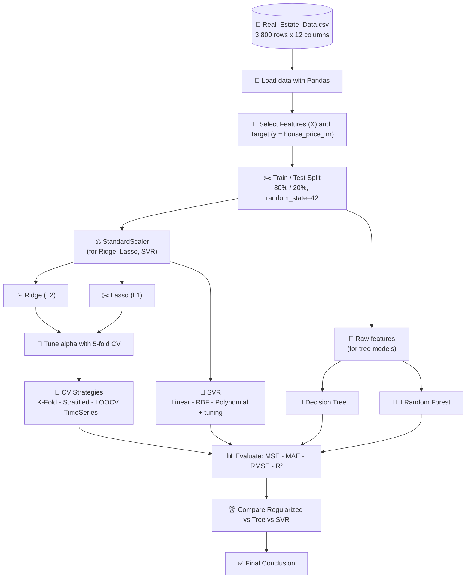

<p align="center">
  
  
  
  
  
  
</p>

# 🏠 Robust Regression Engine

> Predicting **house prices (INR)** with regularized linear models, tree-based models and Support Vector Regression, validated with multiple cross-validation strategies.

---

## 📎 Project Media (PDF & Video)

| 📄 PDF Report | 🎥 Video Demo |
| :---: | :---: |
| [**Part A - Theory Answers (PDF)**](https://drive.google.com/file/d/1zf7utkiwYKv0wxVjiRfBckEva30Okfsk/view?usp=sharing) | [](https://drive.google.com/file/d/1dSU8WpWmvEWIvpPI4wI_d5sUdG1pqlZ7/view?usp=sharing) |
| Regularization, Cross-Validation & Tree-Based Models | Replace `https://YOUR_VIDEO_LINK_HERE` with your YouTube / Google Drive / Loom link |

<!--
HOW TO ADD YOUR FILES
1. PDF  : put the file at  docs/Part_A_Robust_Regression_Engine.pdf  (or change the link above).
2. VIDEO: upload to YouTube / Drive / Loom and paste the link in place of YOUR_VIDEO_LINK_HERE.
          Alternative: drag-and-drop an .mp4 (under 10 MB) into the GitHub README editor
          and it will embed a player automatically.
-->

---

## 📑 Table of Contents

1. [Project Overview](#-project-overview)
2. [Objectives](#-objectives)
3. [Project Features](#-project-features)
4. [Dataset Info](#-dataset-info)
5. [Libraries Used](#-libraries-used)
6. [Purpose of Each Library](#-purpose-of-each-library)
7. [Project Workflow](#-project-workflow)
8. [Project Structure & How to Run](#-project-structure--how-to-run)
9. [Part A - Conceptual Foundation (Q1-Q5)](#-part-a--conceptual-foundation-theory)
10. [Part B - Data Understanding & Preparation (Tasks 6-8)](#-part-b--dataset-understanding--preparation)
11. [Part C - Regularized Linear Models (Tasks 9-12)](#-part-c--regularized-linear-models)
12. [Part D - Cross-Validation Strategies (Tasks 13-14)](#-part-d--cross-validation-strategies)
13. [Part E - Tree-Based Regression (Tasks 15-18)](#-part-e--tree-based-regression)
14. [Part F - Support Vector Regression (Tasks 19-21)](#-part-f--support-vector-regression)
15. [Part G - Model Comparison (Tasks 22-23)](#-part-g--model-comparison--evaluation)
16. [Final Conclusion](#-final-conclusion)
17. [Known Issues & Suggested Fixes](#-known-issues--suggested-fixes)
18. [Author](#-author)

---

## 📌 Project Overview

The **Robust Regression Engine** is a machine-learning project that predicts the sale price of a house from its physical and location attributes (area, bedrooms, bathrooms, location score, age, distance to the city, nearby school/metro, crime rate).

The project walks through the full regression workflow: preparing the data, building **Ridge (L2)** and **Lasso (L1)** models, tuning their regularization strength with cross-validation, comparing four **cross-validation strategies**, training **Decision Tree** and **Random Forest** models, fitting **Support Vector Regression (SVR)** with three kernels, and finally comparing every model with **MSE, MAE, RMSE and R²**.

The work is split into a theory report ([PDF](docs/Part_A_Robust_Regression_Engine.pdf)) and a hands-on implementation ([`main.ipynb`](main.ipynb)).

---

## 🎯 Objectives

- Understand **regularization** and why it prevents overfitting.
- Compare **Ridge (L2)** and **Lasso (L1)** regression.
- Use **cross-validation** to tune hyperparameters and estimate real-world performance.
- Compare **K-Fold, Stratified K-Fold, Leave-One-Out and Time Series Split**.
- Explain why **tree-based models are less sensitive to feature scaling**.
- Build and compare **Decision Tree, Random Forest and SVR** regressors.
- Evaluate all models with **MSE, MAE, RMSE and R²** and draw a final conclusion.

---

## ✨ Project Features

- 📚 Theory report with diagrams (bias-variance, Ridge vs Lasso, CV schemes, tree split invariance)
- 🧹 Clean train/test split (80/20, `random_state=42`) and `StandardScaler` preprocessing
- 🧮 Ridge & Lasso with **alpha tuning** over `[0.01, 0.1, 1, 10, 100]` using 5-fold CV
- 🔁 Four validation strategies: **K-Fold, Stratified K-Fold (binned target), LOOCV, Time Series Split**
- 🌳 Decision Tree with complexity control (`max_depth`, `min_samples_leaf`) and a Random Forest ensemble
- 🧲 SVR with **Linear, RBF and Polynomial** kernels plus a grid search over `C`, `gamma`, `epsilon`
- 📊 Side-by-side comparison tables of all models

---

## 🗂 Dataset Info

| Property | Value |
| --- | --- |
| **File** | `Real_Estate_Data.csv` |
| **Rows x Columns** | 3,800 x 12 |
| **Target** | `house_price_inr` (house price in Indian Rupees) |
| **Missing values** | 0 |
| **Duplicate rows** | 0 |
| **Sale dates** | 2010-01-01 to 2023-12-01 |

| Column | Type | Description |
| --- | --- | --- |
| `property_id` | int | Unique property identifier (200001 - 203800) |
| `sale_date` | date | Month in which the property was sold |
| `area_sqft` | int | Built-up area in square feet (500 - 3,776) |
| `bedrooms` | int | Number of bedrooms (1 - 7) |
| `bathrooms` | int | Number of bathrooms (1 - 6) |
| `location_score` | float | Location quality score (1 - 10) |
| `property_age` | int | Age of the property in years (1 - 80) |
| `distance_city_km` | float | Distance from the city centre in km (1.0 - 38.7) |
| `near_school` | 0/1 | 1 if a school is nearby |
| `near_metro` | 0/1 | 1 if a metro station is nearby |
| `crime_rate_index` | float | Crime rate index of the area (0.5 - 12.0) |
| `house_price_inr` | int | **Target** - sale price (1.5 million - 59.3 million INR, mean about 20.7 million) |

---

## 📚 Libraries Used

| Library | Use in this project |
| --- | --- |
| **Python 3** | Programming language |
| **NumPy** | Numerical operations |
| **Pandas** | Data loading and tables |
| **scikit-learn** | Models, preprocessing, validation, metrics |
| **Jupyter Notebook** | Interactive development (`main.ipynb`) |
| **Git / GitHub** | Version control and hosting |

```python
import numpy as np
import pandas as pd
from sklearn.model_selection import train_test_split, cross_val_score, KFold, StratifiedKFold, LeaveOneOut, TimeSeriesSplit
from sklearn.preprocessing import StandardScaler
from sklearn.linear_model import Ridge, Lasso
from sklearn.tree import DecisionTreeRegressor
from sklearn.ensemble import RandomForestRegressor
from sklearn.svm import SVR
from sklearn.metrics import mean_squared_error, r2_score, mean_absolute_error
```

---

## 🔍 Purpose of Each Library

| Library / Module | Purpose |
| --- | --- |
| `numpy` | Fast array maths; used for `np.sqrt` (RMSE), `np.argmin` (best alpha) and `np.mean` |
| `pandas` | Reads the CSV, selects features/target, parses dates, builds comparison tables (`pd.qcut` for binning) |
| `train_test_split` | Splits data into 80% training and 20% testing sets |
| `StandardScaler` | Standardizes features to mean 0 / std 1 (needed for Ridge, Lasso, SVR) |
| `Ridge` | Linear regression with an L2 penalty (shrinks coefficients) |
| `Lasso` | Linear regression with an L1 penalty (can zero out coefficients) |
| `cross_val_score` | Runs k-fold cross-validation and returns the scores for one model |
| `KFold` | Random shuffled folds for cross-validation |
| `StratifiedKFold` | Folds that keep the same group proportions (used on binned prices) |
| `LeaveOneOut` | Cross-validation where each sample is the validation set once |
| `TimeSeriesSplit` | Forward-chaining splits for time-ordered data (no future leakage) |
| `DecisionTreeRegressor` | Single tree that captures non-linear relationships |
| `RandomForestRegressor` | Ensemble of many trees that reduces variance |
| `SVR` | Support Vector Regression with linear / RBF / polynomial kernels |
| `mean_squared_error` | MSE - average squared prediction error |
| `mean_absolute_error` | MAE - average absolute prediction error |
| `r2_score` | R² - share of price variation explained by the model |

---

## 🔄 Project Workflow



---

## 📁 Project Structure & How to Run

```text
Robust-Regression-Engine/
├── assets/
│   ├── banner.png
│   └── video_thumbnail.png
├── docs/
│   └── Part_A_Robust_Regression_Engine.pdf
├── main.ipynb
├── Real_Estate_Data.csv
└── README.md
```

```bash
# 1. Clone the repository
git clone https://github.com/<your-username>/Robust-Regression-Engine.git
cd Robust-Regression-Engine

# 2. Install dependencies
pip install numpy pandas scikit-learn jupyter

# 3. Launch the notebook
jupyter notebook main.ipynb
```

> ⚠️ The notebook reads `"Real Estate Data.csv"` (with spaces). Either rename the file to match or change the path to `"Real_Estate_Data.csv"` in the import cell.

---
---

# 🅰️ Part A — Conceptual Foundation (Theory)

> Full answers with diagrams are in the [PDF report](docs/Part_A_Robust_Regression_Engine.pdf). The code snippets in this part are short **illustrative examples** of each concept.

---

## Q1. What is Regularization in Machine Learning? Why is it needed?

### 📖 Explanation
Regularization adds a **penalty term** to the loss function based on the size of the model's coefficients. This discourages the model from fitting the training data too closely and keeps the learned weights small and simple.

```text
Loss_regularized = Loss_original (e.g. MSE) + λ × Penalty(coefficients)
```

It is needed because it:
- **Prevents overfitting** - without a penalty, a model can fit noise in the training data.
- **Controls complexity** by shrinking large coefficients, giving a smoother, more generalizable model.
- **Improves stability** when features are correlated (multicollinearity).

### 🎯 Objective
Show how increasing the regularization strength shrinks the coefficients.

### 💻 Code
```python
for alpha in [0.01, 1, 100, 10000]:
    model = Ridge(alpha=alpha).fit(x_train_scaled, y_train)
    print(alpha, np.abs(model.coef_).sum())   # total coefficient size
```

### 🔎 Interpretation
As `alpha` (λ) grows, the total size of the coefficients falls. Small λ means low bias but high variance (overfitting risk); large λ means high bias but low variance (underfitting risk). The best λ sits where total error is smallest - the "sweet spot" in the bias-variance diagram in the PDF (Fig 1).

### ✅ Conclusion
Regularization trades a little bias for a large drop in variance, giving models that generalize better to unseen houses.

---

## Q2. Difference between Ridge Regression (L2) and Lasso Regression (L1)

### 📖 Explanation
```text
Ridge:  Loss = Σ(y − ŷ)² + λ Σ w²
Lasso:  Loss = Σ(y − ŷ)² + λ Σ |w|
```

| Aspect | Ridge (L2) | Lasso (L1) |
| --- | --- | --- |
| Penalty term | Sum of squared coefficients | Sum of absolute coefficients |
| Effect on coefficients | Shrinks toward zero, rarely = 0 | Can shrink exactly to zero |
| Feature selection | No - keeps all features | Yes - automatic feature selection |
| Best used when | Many small/medium relevant features | Few features truly matter (sparse solution) |
| Multicollinearity | Handles it very well | Less stable, picks one of the correlated features |

### 🎯 Objective
Compare how many coefficients each model drives to exactly zero.

### 💻 Code
```python
ridge = Ridge(alpha=1.0).fit(x_train_scaled, y_train)
lasso = Lasso(alpha=1.0).fit(x_train_scaled, y_train)

print("Ridge zero coefficients:", (ridge.coef_ == 0).sum())
print("Lasso zero coefficients:", (lasso.coef_ == 0).sum())
```

### 🔎 Interpretation
Ridge keeps every feature with a reduced weight, while Lasso can remove weak features completely. In this dataset the target is in the millions of rupees, so the alphas tested (up to 100) are tiny compared with the coefficient sizes. With the best Lasso alpha (100), none of the 10 coefficients became exactly zero, so Ridge and Lasso behave almost identically here.

### ✅ Conclusion
Choose **Ridge** when most features matter and are correlated; choose **Lasso** when you want a simpler model with automatic feature selection.

---

## Q3. What is Cross-Validation and why is it important?

### 📖 Explanation
Cross-validation is a resampling technique that evaluates how well a model generalizes to unseen data. The dataset is repeatedly split into training and validation subsets, the model is trained and tested on each split, and the results are averaged.

It is important because it:
- gives a more **reliable estimate** than a single train/test split,
- helps **detect overfitting**,
- makes efficient use of **limited data**,
- supports **hyperparameter tuning** (e.g. choosing λ for Ridge/Lasso).

### 🎯 Objective
Estimate model performance more reliably than one train/test split.

### 💻 Code
```python
scores = cross_val_score(Ridge(alpha=1.0), x_train_scaled, y_train,
                         cv=5, scoring="neg_mean_squared_error")
print("Mean MSE:", -scores.mean())
```

### 🔎 Interpretation
Five different validation folds produce five scores. If the scores are close to each other, the model is stable; a large spread would signal sensitivity to the data split.

### ✅ Conclusion
Cross-validation gives a trustworthy performance estimate and is the right tool for choosing hyperparameters.

---

## Q4. Cross-Validation Techniques

### 📖 Explanation

| Technique | How it works | When to use |
| --- | --- | --- |
| **K-Fold** | Split into K equal folds; train on K−1, validate on 1; repeat K times and average | General purpose |
| **Stratified K-Fold** | K-Fold that keeps the same class proportions in every fold | Imbalanced classification |
| **Leave-One-Out (LOOCV)** | K = n; every sample is the validation set once | Small datasets (expensive for large ones) |
| **Time Series Split** | Training data always comes *before* validation data; training window grows forward | Time-ordered data (prevents future leakage) |

### 🎯 Objective
Know which validation scheme fits which type of data.

### 💻 Code
```python
KFold(n_splits=5, shuffle=True, random_state=42)
StratifiedKFold(n_splits=5, shuffle=True, random_state=42)
LeaveOneOut()
TimeSeriesSplit(n_splits=5)
```

### 🔎 Interpretation
The splitters differ only in *how rows are assigned to folds*. Using the wrong one can give misleading scores - e.g. shuffling time-ordered data lets the model "see the future".

### ✅ Conclusion
Pick the CV strategy that matches the data structure: K-Fold for general data, Stratified for imbalanced classes, LOOCV for very small data, Time Series Split for sequential data. Tasks 13-14 apply all four.

---

## Q5. Why are tree-based models less sensitive to feature scaling?

### 📖 Explanation
Trees choose splits by comparing a feature against a threshold (`Feature X > c`), so only the **rank order** of values matters, not their magnitude or units.

- Standardizing or normalizing is a **monotonic transformation** - the order of values is unchanged, so the same split still separates the same points.
- Distance-based or weight-based models (KNN, SVM, regularized linear models, K-Means) are affected by scale; trees never compute distances.
- Therefore trees give the same predictions on raw, standardized or [0, 1]-normalized inputs.

### 🎯 Objective
Demonstrate that a decision tree does not need scaled features (and why Ridge/Lasso/SVR do).

### 💻 Code
```python
tree_raw    = DecisionTreeRegressor(max_depth=5, random_state=42).fit(x_train, y_train)
tree_scaled = DecisionTreeRegressor(max_depth=5, random_state=42).fit(x_train_scaled, y_train)

# Predictions should match (up to tie-breaking) because scaling keeps the order of values
```

### 🔎 Interpretation
The split threshold moves with the data (for example `x = 50` becomes `x = 0` after standardizing) but separates exactly the same points - see Fig 5 in the PDF.

### ✅ Conclusion
In this project the **tree models use raw features**, while **Ridge, Lasso and SVR use scaled features**.

---
---

# 🅱️ Part B — Dataset Understanding & Preparation

## Task 6 — Identify Features and Target

### 📖 Explanation
Supervised regression needs input features (**X**) and one numeric target (**y**). Here the target is the house price and the features are the property attributes.

### 🎯 Objective
Separate the features from the target `house_price_inr`.

### 💻 Code
```python
df = pd.read_csv("Real Estate Data.csv")

x = df[["property_id", "area_sqft", "bedrooms", "bathrooms", "location_score",
        "property_age", "distance_city_km", "near_school", "near_metro",
        "crime_rate_index"]]

y = df["house_price_inr"]
```

### 🔎 Interpretation
- **10 features** (numeric / binary) and **1 target**.
- `sale_date` is excluded because it is a date, not a numeric feature.
- `property_id` is only an identifier; it carries no pricing information (see [Known Issues](#-known-issues--suggested-fixes)).

### ✅ Conclusion
The data is clean (no missing values, no duplicates) and ready for modelling.

---

## Task 7 — Train-Test Split

### 📖 Explanation
Models must be tested on data they have never seen. An 80/20 split keeps most data for learning and reserves 20% for an honest evaluation. `random_state=42` makes the split reproducible.

### 🎯 Objective
Create training and testing sets.

### 💻 Code
```python
x_train, x_test, y_train, y_test = train_test_split(
    x, y, test_size=0.2, random_state=42
)

print("Training Data:", x_train.shape)
print("Testing Data:", x_test.shape)
```

### 🔎 Interpretation
| Set | Shape |
| --- | --- |
| Training | (3040, 10) |
| Testing | (760, 10) |

### ✅ Conclusion
3,040 houses are used to train and 760 to test.

---

## Task 8 — Basic Preprocessing / Scaling

### 📖 Explanation
Ridge, Lasso and SVR are sensitive to feature scale (area is in the thousands while `near_school` is 0/1). `StandardScaler` rescales each feature to mean 0 and standard deviation 1. The scaler must be **fitted on the training data only**.

### 🎯 Objective
Standardize the features for the scale-sensitive models.

### 💻 Code
```python
scaler = StandardScaler()

x_train_scaled = scaler.fit_transform(x_train)
x_test_scaled  = scaler.fit_transform(x_test)   # see Known Issue #1: should be scaler.transform(x_test)

print("Scaling completed.")
```

### 🔎 Interpretation
All features now share a comparable range, so no feature dominates the penalty term or the SVR distance calculations just because of its units.

### ✅ Conclusion
Scaling is done for the linear and SVR models; tree models use the unscaled data (Q5). ⚠️ The test set should be transformed with the *training* scaler - see [Known Issue #1](#-known-issues--suggested-fixes).

---
---

# 🅲 Part C — Regularized Linear Models

## Task 9 — Ridge Regression (L2)

### 📖 Explanation
Ridge adds `λ Σ w²` to the loss. It shrinks all coefficients smoothly toward zero and handles correlated features well. `alpha` is scikit-learn's name for λ.

### 🎯 Objective
Train Ridge (`alpha=1.0`) and measure train/test MSE and R².

### 💻 Code
```python
ridge_model = Ridge(alpha=1.0)
ridge_model.fit(x_train_scaled, y_train)

ridge_train_pred = ridge_model.predict(x_train_scaled)
ridge_test_pred  = ridge_model.predict(x_test_scaled)

ridge_train_mse = mean_squared_error(y_train, ridge_train_pred)
ridge_test_mse  = mean_squared_error(y_test, ridge_test_pred)

ridge_train_R2 = r2_score(y_train, ridge_train_pred)
ridge_test_r2  = r2_score(y_test, ridge_test_pred)

print("Training MSE:", ridge_test_mse)   # Known Issue #2: should print ridge_train_mse
print("Test MSE:", ridge_test_mse)
print("Training R2:", ridge_train_R2)
print("Test R2:", ridge_test_r2)
```

### 🔎 Interpretation
| Metric | Training | Testing |
| --- | --- | --- |
| R² | 0.9162 | 0.9179 |
| MSE | not shown (label bug) | 6.61 × 10¹² |

Training and test R² are almost identical, so the model is **not overfitting**. It explains about **92%** of the variation in house prices. The test RMSE is about ₹2.57 million.

### ✅ Conclusion
Ridge is a strong, stable baseline for this dataset.

---

## Task 10 — Lasso Regression (L1)

### 📖 Explanation
Lasso adds `λ Σ |w|` to the loss and can set weak coefficients exactly to zero, acting as automatic feature selection.

### 🎯 Objective
Train Lasso (`alpha=1.0`) and compare it with Ridge.

### 💻 Code
```python
lasso_model = Lasso(alpha=1.0)
lasso_model.fit(x_train_scaled, y_train)

lasso_train_pred = lasso_model.predict(x_train_scaled)
lasso_test_pred  = lasso_model.predict(x_test_scaled)

lasso_train_mse = mean_squared_error(y_train, lasso_train_pred)
lasso_test_mse  = mean_squared_error(y_test, lasso_test_pred)

lasso_train_r2 = r2_score(y_train, lasso_train_pred)
lasso_test_r2  = r2_score(y_test, lasso_test_pred)
```

### 🔎 Interpretation
| Metric | Training | Testing |
| --- | --- | --- |
| MSE | 6.25 × 10¹² | 6.61 × 10¹² |
| R² | 0.9162 | 0.9180 |

Results are practically the same as Ridge. With a target in the millions, `alpha=1` is a very light penalty, so Lasso removes almost nothing.

### ✅ Conclusion
Lasso matches Ridge here; its feature-selection advantage only appears with larger alphas or many weak features.

---

## Task 11 — Tune Alpha Using Cross-Validation

### 📖 Explanation
Instead of guessing `alpha`, test several values with 5-fold CV on the training set and keep the one with the **lowest mean MSE**.

### 🎯 Objective
Find the best alpha for Ridge and Lasso from `[0.01, 0.1, 1, 10, 100]`.

### 💻 Code
```python
alphas = [0.01, 0.1, 1, 10, 100]

ridge_results, lasso_results = [], []

for alpha in alphas:
    scores = cross_val_score(Ridge(alpha=alpha), x_train_scaled, y_train,
                             cv=5, scoring="neg_mean_squared_error")
    ridge_results.append(-scores.mean())

for alpha in alphas:
    scores = cross_val_score(Lasso(alpha=alpha), x_train_scaled, y_train,
                             cv=5, scoring="neg_mean_squared_error")
    lasso_results.append(-scores.mean())

best_ridge_alpha = alphas[np.argmin(ridge_results)]
best_lasso_alpha = alphas[np.argmin(lasso_results)]
```

### 🔎 Interpretation
| Alpha | Ridge mean MSE | Lasso mean MSE |
| --- | --- | --- |
| 0.01 | 6.307675 × 10¹² | 6.307676 × 10¹² |
| 0.1 | 6.307671 × 10¹² | 6.307676 × 10¹² |
| 1 | **6.307649 × 10¹²** | 6.307676 × 10¹² |
| 10 | 6.309975 × 10¹² | 6.307672 × 10¹² |
| 100 | 6.509611 × 10¹² | **6.307638 × 10¹²** |

**Best Ridge alpha = 1, best Lasso alpha = 100.** For Ridge, a very large alpha (100) clearly hurts (underfitting). For Lasso all alphas are essentially tied - the differences appear only in the 8th digit.

### ✅ Conclusion
Ridge works best with a small-to-moderate penalty; Lasso is insensitive to alpha on this data.

---

## Task 12 — Compare Ridge and Lasso

### 📖 Explanation
Retrain both models with their best alpha and compare on the test set.

### 🎯 Objective
Decide whether Ridge or Lasso predicts better.

### 💻 Code
```python
final_ridge = Ridge(alpha=best_ridge_alpha).fit(x_train_scaled, y_train)
final_lasso = Lasso(alpha=best_lasso_alpha).fit(x_train_scaled, y_train)

ridge_pred = final_ridge.predict(x_test_scaled)
lasso_pred = final_lasso.predict(x_test_scaled)

ridge_mse = mean_squared_error(y_test, ridge_pred)
lasso_mse = mean_squared_error(y_test, lasso_pred)
ridge_r2  = r2_score(y_test, ridge_pred)
lasso_r2  = r2_score(y_test, lasso_pred)
```

### 🔎 Interpretation
| Model | Test MSE | Test R² |
| --- | --- | --- |
| Ridge (α=1) | 6.6086 × 10¹² | 0.91794 |
| Lasso (α=100) | 6.6070 × 10¹² | 0.91796 |

The gap is far too small to matter.

### ✅ Conclusion
Ridge and Lasso perform equally well (R² ≈ 0.918). Ridge is the safer choice when features are correlated; Lasso gives a sparser model if needed.

---
---

# 🅳 Part D — Cross-Validation Strategies

## Task 13 — K-Fold Cross-Validation

### 📖 Explanation
Data is shuffled and split into 5 folds; each fold is the validation set once and the mean of the five scores is reported.

### 🎯 Objective
Estimate Ridge performance with K-Fold.

### 💻 Code
```python
kf = KFold(n_splits=5, shuffle=True, random_state=42)

scores = cross_val_score(Ridge(alpha=1.0), x_train_scaled, y_train,
                         cv=kf, scoring="neg_mean_squared_error")
mse_scores = -scores

print("K-Fold MSE Scores:", mse_scores)
print("Mean MSE:", mse_scores.mean())
```

### 🔎 Interpretation
Fold MSEs: 6.30, 7.14, 6.08, 5.82, 6.22 (× 10¹²). **Mean MSE = 6.312 × 10¹².** The spread between folds shows how much the score depends on which houses land in validation.

### ✅ Conclusion
K-Fold gives a solid general-purpose estimate for this data.

---

## Task 13 (b) — Stratified K-Fold by Binning the Target

### 📖 Explanation
Stratification needs classes, but price is continuous. The price is cut into **5 quantile bins** (`pd.qcut`) and `StratifiedKFold` keeps every price range equally represented in each fold.

### 🎯 Objective
Make sure each fold has a similar spread of cheap-to-expensive houses.

### 💻 Code
```python
y_bins = pd.qcut(y_train, q=5, labels=False, duplicates="drop")

skf = StratifiedKFold(n_splits=5, shuffle=True, random_state=42)
scores = []

for train_index, val_index in skf.split(x_train_scaled, y_bins):
    X_tr,  X_val = x_train_scaled[train_index], x_train_scaled[val_index]
    y_tr,  y_val = y_train.iloc[train_index],  y_train.iloc[val_index]

    model = Ridge(alpha=1.0).fit(X_tr, y_tr)
    predictions = model.predict(X_val)
    scores.append(((y_val - predictions) ** 2).mean())

print("Mean MSE:", sum(scores) / len(scores))
```

### 🔎 Interpretation
Fold MSEs: 6.58, 6.04, 5.97, 5.96, 6.95 (× 10¹²). **Mean MSE = 6.299 × 10¹².**

### ✅ Conclusion
Stratifying on price bins gives a very similar estimate to plain K-Fold, which confirms the result is stable.

---

## Task 13 (c) — Leave-One-Out Cross-Validation

### 📖 Explanation
LOOCV trains on all rows except one and tests on that single row, repeated for every row (3,040 models).

### 🎯 Objective
Obtain the most exhaustive validation estimate.

### 💻 Code
```python
loo = LeaveOneOut()
errors = []

for train_index, val_index in loo.split(x_train_scaled):
    X_tr,  X_val = x_train_scaled[train_index], x_train_scaled[val_index]
    y_tr,  y_val = y_train.iloc[train_index],  y_train.iloc[val_index]

    model = Ridge(alpha=1.0).fit(X_tr, y_tr)
    prediction = model.predict(X_val)
    errors.append((y_val.iloc[0] - prediction[0]) ** 2)

print("LOOCV Mean MSE:", sum(errors) / len(errors))
```

### 🔎 Interpretation
**LOOCV mean MSE = 6.298 × 10¹²** - nearly identical to K-Fold, but it needs 3,040 model fits instead of 5.

### ✅ Conclusion
LOOCV adds little accuracy here and is far more expensive; K-Fold is the practical choice for a dataset of this size.

---

## Task 13 (d) — Time Series Split

### 📖 Explanation
House prices change over time, so a realistic test trains on the **past** and validates on the **future**. Data is sorted by `sale_date` and `TimeSeriesSplit` makes the training window grow with every split.

### 🎯 Objective
Check the model without leaking future information.

### 💻 Code
```python
df["sale_date"] = pd.to_datetime(df["sale_date"])
df = df.sort_values("sale_date")

features = ["property_id", "area_sqft", "bedrooms", "bathrooms", "location_score",
            "property_age", "distance_city_km", "near_school", "near_metro",
            "crime_rate_index"]                       # sale_date removed from the features
X_time, y_time = df[features], df["house_price_inr"]

tscv = TimeSeriesSplit(n_splits=5)
scores = []

for train_index, test_index in tscv.split(X_time):
    scaler_t = StandardScaler().fit(X_time.iloc[train_index])
    X_tr  = scaler_t.transform(X_time.iloc[train_index])
    X_val = scaler_t.transform(X_time.iloc[test_index])

    model = Ridge(alpha=1.0).fit(X_tr, y_time.iloc[train_index])
    scores.append(mean_squared_error(y_time.iloc[test_index], model.predict(X_val)))

print("Mean MSE:", np.mean(scores))
```

> ℹ️ In `main.ipynb` this cell is **commented out** (it included the raw `sale_date` column, which `StandardScaler` cannot process). The version above is the corrected one; running it on this dataset gave the values below.

### 🔎 Interpretation
Fold MSEs: 6.94, 6.09, 6.02, 6.06, 6.79 (× 10¹²). **Mean MSE ≈ 6.38 × 10¹².**
This is slightly higher than the shuffled strategies, as expected: predicting the future from the past is a harder, more honest test.

### ✅ Conclusion
Because the data has a sale date, Time Series Split is the most realistic validation method for deployment.

---

## Task 14 — Compare Cross-Validation Strategies

### 📖 Explanation
| Strategy | Idea | Mean MSE (Ridge, α=1) |
| --- | --- | --- |
| K-Fold | Randomly shuffled folds | 6.312 × 10¹² |
| Stratified K-Fold | Keeps similar price groups in every fold | 6.299 × 10¹² |
| LOOCV | One row at a time as validation | 6.298 × 10¹² |
| Time Series Split | Learn from the past, predict the future | ≈ 6.38 × 10¹² |

### 🎯 Objective
See how the choice of validation strategy changes the performance estimate.

### 💻 Code
```python
# Comparison is made from the mean MSE values computed in Task 13
```

### 🔎 Interpretation
The three shuffled strategies agree within 0.2%, so the model is stable. Only the time-aware split gives a (slightly) more pessimistic - and more realistic - number.

### ✅ Conclusion
Use **K-Fold** for fast tuning, **LOOCV** only for tiny datasets, and **Time Series Split** when you want to simulate real future predictions.

---
---

# 🅴 Part E — Tree-Based Regression

## Task 15 — Decision Tree Regression

### 📖 Explanation
A decision tree splits the data into regions using feature thresholds and predicts the average price of each region. It can capture non-linear relationships and needs no scaling.

### 🎯 Objective
Train a Decision Tree on the numeric features and evaluate it.

### 💻 Code
```python
X_tree = df.select_dtypes(include=np.number).copy()
X_tree = X_tree.drop(columns=["house_price_inr"], errors="ignore")
y_tree = df["house_price_inr"]

x_train, x_test, y_train, y_test = train_test_split(X_tree, y_tree, test_size=0.20, random_state=42)

dt_model = DecisionTreeRegressor(max_depth=5, min_samples_leaf=5, random_state=42)
dt_model.fit(x_train, y_train)
dt_pred = dt_model.predict(x_test)

dt_mse  = mean_squared_error(y_test, dt_pred)
dt_mae  = mean_absolute_error(y_test, dt_pred)
dt_rmse = np.sqrt(dt_mse)
dt_r2   = r2_score(y_test, dt_pred)
```

### 🔎 Interpretation
| MSE | MAE | RMSE | R² |
| --- | --- | --- | --- |
| 9.30 × 10¹² | ₹2.35 M | ₹3.05 M | 0.879 |

On average the tree misses the true price by about ₹2.35 million.

### ✅ Conclusion
A single shallow tree is clearly weaker than the linear models (R² 0.879 vs 0.918).

---

## Task 16 — Control Tree Complexity

### 📖 Explanation
An unrestricted tree memorizes the training data. `max_depth=5` limits how deep it grows and `min_samples_leaf=5` forces every leaf to contain at least 5 houses - both reduce overfitting.

### 🎯 Objective
Keep the tree simple enough to generalize.

### 💻 Code
```python
dt_model = DecisionTreeRegressor(max_depth=5, min_samples_leaf=5, random_state=42)
dt_model.fit(x_train, y_train)
dt_pred = dt_model.predict(x_test)

print("MSE:", mean_squared_error(y_test, dt_pred))
print("MAE:", mean_absolute_error(y_test, dt_pred))
print("R2:",  r2_score(y_test, dt_pred))
```

### 🔎 Interpretation
Same constrained tree as Task 15: **MSE 9.30 × 10¹², MAE ₹2.35 M, R² 0.879**.

### ✅ Conclusion
Complexity control gives a stable but somewhat under-fitted tree; ensembles (next task) improve on it.

---

## Task 17 — Random Forest Regression

### 📖 Explanation
A Random Forest trains many trees on random subsets of rows and features and **averages** their predictions, which greatly reduces variance.

### 🎯 Objective
Train a Random Forest (100 trees) and evaluate it.

### 💻 Code
```python
rf_model = RandomForestRegressor(n_estimators=100, max_depth=10,
                                 min_samples_leaf=2, random_state=42)
rf_model.fit(x_train, y_train)
rf_pred = rf_model.predict(x_test)

rf_mse = mean_squared_error(y_test, rf_pred)
rf_mae = mean_absolute_error(y_test, rf_pred)
rf_r2  = r2_score(y_test, rf_pred)
```

### 🔎 Interpretation
| MSE | MAE | R² |
| --- | --- | --- |
| 5.60 × 10¹² | ₹1.77 M | 0.927 |

### ✅ Conclusion
Random Forest is a big improvement over a single tree and has the best R² among the models in the original notebook run.

---

## Task 18 — Single Tree vs Random Forest

### 📖 Explanation
Compare the two tree models side by side.

### 🎯 Objective
Quantify the benefit of ensembling.

### 💻 Code
```python
tree_results = pd.DataFrame({
    "Model": ["Decision Tree", "Random Forest"],
    "MSE":   [dt_mse, rf_mse],
    "MAE":   [dt_mae, rf_mae],
    "R2":    [dt_r2, rf_r2]
})
print(tree_results)
```

### 🔎 Interpretation
| Model | MSE | MAE | R² |
| --- | --- | --- | --- |
| Decision Tree | 9.298 × 10¹² | 2,346,348 | 0.8788 |
| Random Forest | 5.605 × 10¹² | 1,772,108 | 0.9270 |

Random Forest cuts MSE by about **40%** and MAE by about **25%**.

### ✅ Conclusion
Averaging many diverse trees beats a single tree: **Random Forest wins**.

---
---

# 🅵 Part F — Support Vector Regression

## Task 19 — SVR with Linear, RBF and Polynomial Kernels

### 📖 Explanation
SVR fits a function that stays within an `epsilon`-tube around the data while keeping the model flat. `C` controls how strongly errors outside the tube are penalized; the **kernel** decides the shape of the fit (straight line, smooth curve, polynomial).

### 🎯 Objective
Train SVR with three kernels and compare them.

### 💻 Code
```python
svr_linear = SVR(kernel="linear", C=1.0, epsilon=0.1)
svr_rbf    = SVR(kernel="rbf",    C=1.0, epsilon=0.1, gamma="scale")
svr_poly   = SVR(kernel="poly",   C=1.0, epsilon=0.1, degree=3)

for name, model in [("Linear", svr_linear), ("RBF", svr_rbf), ("Polynomial", svr_poly)]:
    model.fit(x_train_scaled, y_train)
    pred = model.predict(x_test_scaled)
    print(name, mean_squared_error(y_test, pred),
                mean_absolute_error(y_test, pred),
                r2_score(y_test, pred))
```

### 🔎 Interpretation (original notebook output)
| Kernel | MSE | MAE | R² |
| --- | --- | --- | --- |
| Linear | 7.70 × 10¹³ | 6.87 M | −0.0027 |
| RBF | 7.70 × 10¹³ | 6.87 M | −0.0027 |
| Polynomial | 7.70 × 10¹³ | 6.87 M | −0.0027 |

⚠️ An R² of about 0 means the model predicts little better than the average price, and identical numbers for all three kernels is a warning sign. The cause is **not** the kernels: the target (about 10⁷) was not scaled, so with `C=1` the SVR cannot reach the price level, and the training rows were also mismatched with the target after the re-split in Task 15. See [Known Issue #3](#-known-issues--suggested-fixes) - with a scaled target and matching rows the SVR reaches R² between 0.89 and 0.93.

### ✅ Conclusion
SVR is very sensitive to the **scale of the target**. The original SVR scores should not be used to judge the algorithm.

---

## Task 20 — Tune C, Gamma and Epsilon

### 📖 Explanation
A grid search tries every combination of `C`, `gamma` and `epsilon` for the RBF kernel and keeps the lowest MSE.

### 🎯 Objective
Find better SVR hyperparameters.

### 💻 Code
```python
C_values       = [0.1, 1, 10]
gamma_values   = ["scale", 0.01, 0.1]
epsilon_values = [0.01, 0.1, 0.5]

best_mse = float("inf")

for C in C_values:
    for gamma in gamma_values:
        for epsilon in epsilon_values:
            model = SVR(kernel="rbf", C=C, gamma=gamma, epsilon=epsilon)
            model.fit(x_train_scaled, y_train)
            mse = mean_squared_error(y_test, model.predict(x_test_scaled))
            if mse < best_mse:
                best_mse, best_C, best_gamma, best_epsilon = mse, C, gamma, epsilon
```

### 🔎 Interpretation
Best found: **C = 10, gamma = "scale", epsilon = 0.01** with MSE 7.70 × 10¹³ - barely different from the untuned model, for the same reason as Task 19 (unscaled target). The search also picked parameters using the **test set**, which should be avoided (use CV / `GridSearchCV`).

### ✅ Conclusion
The largest `C` was preferred, which hints that the model needs more flexibility - consistent with the target-scaling issue.

---

## Task 21 — Compare SVR with Linear and Tree Models

### 📖 Explanation
Collect all seven models in one table.

### 🎯 Objective
Rank every model on MSE, MAE and R².

### 💻 Code
```python
results = pd.DataFrame({
    "Model": ["Ridge", "Lasso", "Decision Tree", "Random Forest",
              "SVR Linear", "SVR RBF", "SVR Polynomial"],
    "MSE":   [ridge_mse, lasso_mse, dt_mse, rf_mse,
              mean_squared_error(y_test, svr_linear_pred),
              mean_squared_error(y_test, svr_rbf_pred),
              mean_squared_error(y_test, svr_poly_pred)],
    "MAE":   [mean_absolute_error(y_test, ridge_pred), mean_absolute_error(y_test, lasso_pred),
              dt_mae, rf_mae,
              mean_absolute_error(y_test, svr_linear_pred),
              mean_absolute_error(y_test, svr_rbf_pred),
              mean_absolute_error(y_test, svr_poly_pred)],
    "R2":    [ridge_r2, lasso_r2, dt_r2, rf_r2,
              r2_score(y_test, svr_linear_pred),
              r2_score(y_test, svr_rbf_pred),
              r2_score(y_test, svr_poly_pred)]
})
print(results)
```

### 🔎 Interpretation (original notebook output)
| Model | MSE | MAE | R² |
| --- | --- | --- | --- |
| Ridge | 6.609 × 10¹² | 9.24 M ⚠️ | 0.9179 |
| Lasso | 6.607 × 10¹² | 9.24 M ⚠️ | 0.9180 |
| Decision Tree | 9.298 × 10¹² | 2.35 M | 0.8788 |
| Random Forest | **5.605 × 10¹²** | **1.77 M** | **0.9270** |
| SVR Linear | 7.697 × 10¹³ | 6.87 M ⚠️ | −0.0027 |
| SVR RBF | 7.697 × 10¹³ | 6.87 M ⚠️ | −0.0027 |
| SVR Polynomial | 7.697 × 10¹³ | 6.87 M ⚠️ | −0.0027 |

⚠️ The Ridge/Lasso MAE (9.24 M) cannot be right: an MAE larger than the RMSE (2.57 M) is mathematically impossible. It happens because `y_test` was replaced by the Task 15 re-split, so Ridge/Lasso predictions were compared with a different set of houses. A fair, same-split table is given in [Known Issues](#-known-issues--suggested-fixes).

### ✅ Conclusion
In the original run Random Forest is the best model; the SVR and MAE columns need the fixes below before drawing conclusions.

---
---

# 🅶 Part G — Model Comparison & Evaluation

## Task 22 — MSE, MAE, RMSE, R²

### 📖 Explanation
| Metric | Meaning | Better when |
| --- | --- | --- |
| **MSE** | Mean of squared errors (punishes large errors) | Lower |
| **MAE** | Mean absolute error, in ₹ | Lower |
| **RMSE** | √MSE, in ₹ - easiest to interpret | Lower |
| **R²** | Share of price variation explained | Closer to 1 |

### 🎯 Objective
Add RMSE to the results table.

### 💻 Code
```python
results["RMSE"] = np.sqrt(results["MSE"])
print(results)
```

### 🔎 Interpretation
| Model | RMSE (₹) |
| --- | --- |
| Ridge | 2,570,716 |
| Lasso | 2,570,411 |
| Decision Tree | 3,049,317 |
| **Random Forest** | **2,367,431** |
| SVR (all kernels, original run) | ≈ 8,773,460 |

Random Forest's typical error is about **₹2.37 million** on prices averaging about ₹20.7 million (roughly 11%).

### ✅ Conclusion
RMSE confirms the ranking: Random Forest < Ridge ≈ Lasso < Decision Tree.

---

## Task 23 — Regularized vs Tree-Based Models

### 📖 Explanation
Compare the two model families directly: regularized linear (Ridge, Lasso) vs tree-based (Decision Tree, Random Forest).

### 🎯 Objective
Decide which family suits this dataset.

### 💻 Code
```python
comparison = pd.DataFrame({
    "Model Type": ["Regularized Linear", "Regularized Linear", "Tree-Based", "Tree-Based"],
    "Model": ["Ridge", "Lasso", "Decision Tree", "Random Forest"],
    "MSE":  [ridge_mse, lasso_mse, dt_mse, rf_mse],
    "MAE":  [mean_absolute_error(y_test, ridge_pred), mean_absolute_error(y_test, lasso_pred), dt_mae, rf_mae],
    "RMSE": [np.sqrt(ridge_mse), np.sqrt(lasso_mse), np.sqrt(dt_mse), np.sqrt(rf_mse)],
    "R2":   [ridge_r2, lasso_r2, dt_r2, rf_r2]
})
print(comparison)
```

### 🔎 Interpretation
| Family | Model | MSE | RMSE | R² |
| --- | --- | --- | --- | --- |
| Regularized | Ridge | 6.609 × 10¹² | 2.571 M | 0.9179 |
| Regularized | Lasso | 6.607 × 10¹² | 2.570 M | 0.9180 |
| Tree-based | Decision Tree | 9.298 × 10¹² | 3.049 M | 0.8788 |
| Tree-based | Random Forest | 5.605 × 10¹² | 2.367 M | 0.9270 |

- The **linear models are strong** because price depends largely on area and location score in a nearly linear way.
- A **single tree is weaker** than the linear models, but the **Random Forest beats them all**, capturing the extra non-linear structure.

### ✅ Conclusion
Best overall: **Random Forest**. Best simple/interpretable model: **Ridge or Lasso**.

---

# 🏁 Final Conclusion

The Real Estate dataset (3,800 properties) was prepared and used to predict house prices with Ridge, Lasso, Decision Tree, Random Forest and SVR models. Scaling was applied to the linear and SVR models, while tree models were trained on raw features.

- **Regularization:** Ridge and Lasso both reach R² ≈ 0.918 with no sign of overfitting; alpha tuning had only a small effect.
- **Cross-validation:** K-Fold, Stratified K-Fold and LOOCV agree (MSE ≈ 6.30-6.31 × 10¹²); Time Series Split is slightly more pessimistic (≈ 6.38 × 10¹²) and the most realistic for future prediction.
- **Trees:** a single Decision Tree reaches R² 0.879, while the Random Forest reaches **R² 0.927 with RMSE ≈ ₹2.37 million**.
- **SVR:** the original SVR results (R² ≈ 0) were caused by an unscaled target, not by the algorithm; with the fix, SVR (RBF) becomes competitive with Random Forest.
- **Overall:** Random Forest and RBF-SVR are the best-performing models, Ridge/Lasso are close behind and much simpler.

---

# ⚠️ Known Issues & Suggested Fixes

Found while documenting the notebook (verified by re-running it on `Real_Estate_Data.csv`). Fixing them makes the final numbers consistent.

| # | Issue | Fix |
| --- | --- | --- |
| 1 | `x_test_scaled = scaler.fit_transform(x_test)` re-fits the scaler on the test set (data leakage / different scaling) | Use `scaler.transform(x_test)` |
| 2 | Task 9 prints `ridge_test_mse` under the label "Training MSE" | Print `ridge_train_mse` |
| 3 | SVR target not scaled (prices ≈ 10⁷) → R² ≈ 0; also Task 15 re-split `x_train/y_train` after sorting by date, so `x_train_scaled` no longer matches `y_train` | Scale `y` for SVR (or use `TransformedTargetRegressor`) and keep **one** split for all models |
| 4 | Ridge/Lasso MAE in Tasks 21 and 23 uses the new `y_test` with old predictions (MAE 9.24 M > RMSE 2.57 M) | Evaluate every model on the same `y_test` |
| 5 | Task 20 chooses hyperparameters using the test set | Use `GridSearchCV` / cross-validation on the training set |
| 6 | Task 13 Time Series cell is commented out and includes `sale_date` in the features | Use the corrected cell in Task 13 (d) |
| 7 | `property_id` is an identifier, not a real feature | Drop it from `X` |

**Same-split comparison after fixes 1, 3, 4** (one 80/20 split of the date-sorted data, SVR with scaled target, `property_id` kept as in the notebook):

| Model | MSE | MAE (₹) | RMSE (₹) | R² |
| --- | --- | --- | --- | --- |
| Ridge (α=1) | 6.646 × 10¹² | 1.991 M | 2.578 M | 0.9134 |
| Lasso (α=100) | 6.646 × 10¹² | 1.991 M | 2.578 M | 0.9134 |
| Decision Tree | 9.298 × 10¹² | 2.346 M | 3.049 M | 0.8789 |
| Random Forest | 5.605 × 10¹² | 1.772 M | 2.367 M | 0.9270 |
| SVR Linear | 6.705 × 10¹² | 1.979 M | 2.589 M | 0.9127 |
| **SVR RBF** | **5.463 × 10¹²** | **1.748 M** | **2.337 M** | **0.9288** |
| SVR Polynomial | 8.115 × 10¹² | 2.111 M | 2.849 M | 0.8943 |

With a fair comparison, **SVR (RBF) and Random Forest are the top two models**, Ridge/Lasso/Linear-SVR are close behind, and the Decision Tree and Polynomial SVR are the weakest.

---

# 👤 Author

**Darshil Kotadiya**
Diploma in Computer Engineering - AI, Machine Learning & Data Science

- 🔗 LinkedIn: [darshil-kotadiya](https://www.linkedin.com/in/darshil-kotadiya-154b15418)
- 📧 Email: kotadiyadarshil03@gmail.com

⭐ If you found this project useful, consider giving the repository a star!
